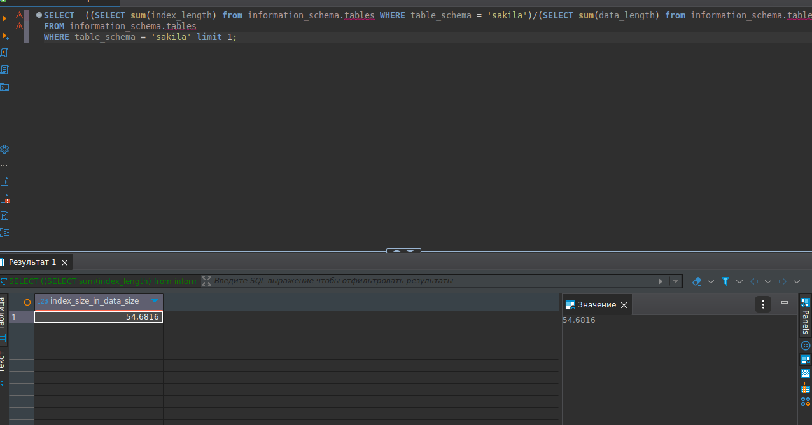
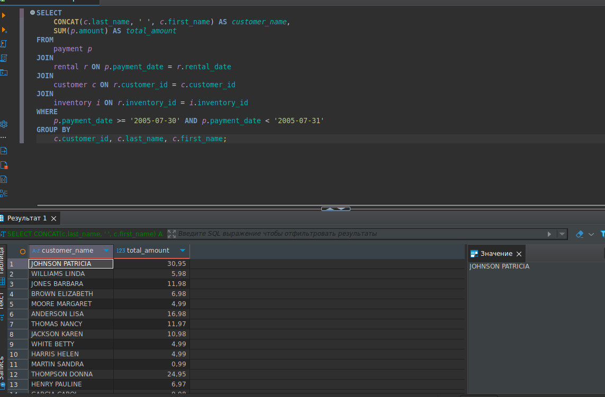

# Домашнее задание к занятию «Индексы»


### Задание 1

Напишите запрос к учебной базе данных, который вернёт процентное отношение общего размера всех индексов к общему размеру всех таблиц.

### Решение:

```sql
SELECT  ((SELECT sum(index_length) from information_schema.tables WHERE table_schema = 'sakila')/(SELECT sum(data_length) from information_schema.tables WHERE table_schema = 'sakila'))*100 as index_size_in_data_size  
       FROM information_schema.tables
       WHERE table_schema = 'sakila' limit 1;
```


### Задание 2

Выполните explain analyze следующего запроса:
```sql
select distinct concat(c.last_name, ' ', c.first_name), sum(p.amount) over (partition by c.customer_id, f.title)
from payment p, rental r, customer c, inventory i, film f
where date(p.payment_date) = '2005-07-30' and p.payment_date = r.rental_date and r.customer_id = c.customer_id and i.inventory_id = r.inventory_id
```
- перечислите узкие места;
- оптимизируйте запрос: внесите корректировки по использованию операторов, при необходимости добавьте индексы.

### Решение:

Узкие места:
1. explain analyze - долгое выполнение оконной функции и группировка по столбцам разных таблиц
2. Таблица film (f) не используется в конечном результате, но участвует в соединениях, что увеличивает нагрузку на запрос
3. Использование неявных JOIN (через WHERE) может затруднить понимание запроса и оптимизацию плана выполнения.

```sql
SELECT 
    CONCAT(c.last_name, ' ', c.first_name) AS customer_name,
    SUM(p.amount) AS total_amount
FROM 
    payment p
JOIN 
    rental r ON p.payment_date = r.rental_date
JOIN 
    customer c ON r.customer_id = c.customer_id
JOIN 
    inventory i ON r.inventory_id = i.inventory_id
WHERE 
    p.payment_date >= '2005-07-30' AND p.payment_date < '2005-07-31'
GROUP BY 
    c.customer_id, c.last_name, c.first_name;
```

